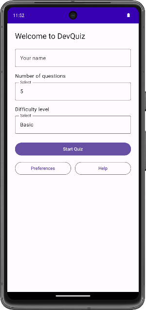
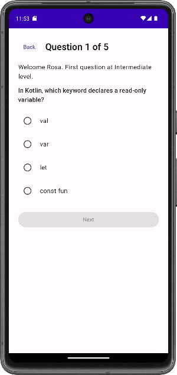
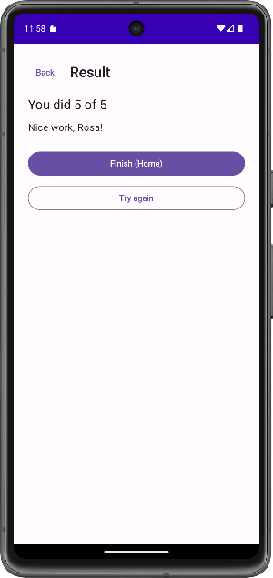

# DevQuiz

A simple multiple-choice quiz for developers built with **Kotlin + Jetpack Compose**.

## Features
- **Main Activity:** enter your name, choose number of questions (5), pick difficulty (Basic / Intermediate / Advanced).
- **Preferences Activity:** change default difficulty, default question count, toggle explanations and shuffle.
- **Quiz Activity (Secondary):** shows 5 questions per difficulty with single-select answers.
- **Help Activity:** explains the app and preferences.
- **Result:** shows “You scored X/5” and buttons to go Home or Try Again at the same level.

## How to Run
1. Open in **Android Studio** (Giraffe+).
2. Click **Run ▶️** on an emulator (e.g., Pixel 7, API 34).

## Screenshots
Main Activity  

Quiz  

Result  

## Tech
- Kotlin, Jetpack Compose (Material 3)
- Intents between activities
- (Optional next step) DataStore/SharedPreferences for persisted settings

## Student Notes
- Default number of questions is **5**.
- Difficulties: **Basic, Intermediate, Advanced**.
- Example outcome: “You scored 3/5”.
